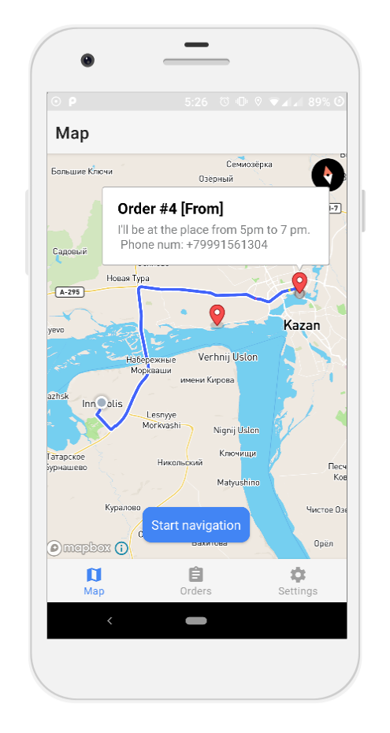

# Delivery operator application
Navigation app for the delivery operators with connection to the server as to get/send info about the orders.\
Used language: Kotlin\
Author: Vladislav Kuleykin

## Purpose
This application was created as a part of system for a delivery company for Software Architecture course.

## How to run
This app currently works by using the MapBox API, so to use it, you'll need to get the MapBox access token and put it in the `values\string.xml` at `access token` string. (This is only for now, as in the future we'll store this more safely)

## Screenshots

  
  

